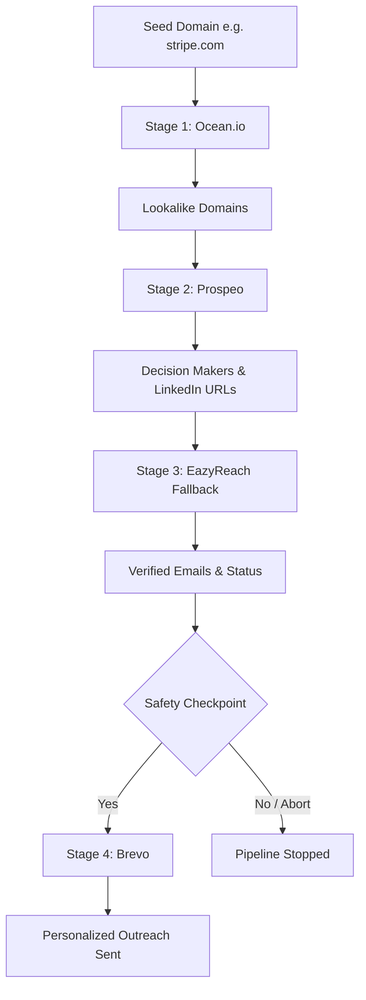

# Automated Outreach Pipeline

A robust, production-ready Node.js CLI application that executes an automated 4-stage outreach pipeline:

`Ocean.io -> Prospeo -> EazyReach (Prospeo Fallback) -> Safety Checkpoint -> Brevo`

It accepts a target seed company domain (e.g. `stripe.com`), sources lookalike companies, scrapes decision makers, resolves verified emails, and automatically dispatches personalized outreach templates.

---

## 1. Pipeline Flow Diagram



---

## 2. Assignment Requirements Mapping

| Assignment Requirement | Implementation |
| :--- | :--- |
| **One domain input** | Positional command-line argument handled via `commander` CLI parser (e.g. `node src/index.js stripe.com`). |
| **Ocean.io stage** | Hitting `/v3/search/companies` using `lookalikeDomains` filters to retrieve similar domains. |
| **Prospeo stage** | Hitting `/search-person` using targeted `person_search` filters to get C-Suite/VP decision makers & LinkedIn URLs. |
| **EazyReach stage** | LinkedIn URL to email enrichment. Handoff is routed to the compliant Prospeo `/enrich-person` API. |
| **Brevo stage** | Generating custom templates and dispatching transactional emails via `/smtp/email`. |
| **Safety checkpoint** | A console table rendering sourced metrics with a strict manual `yes` input requirement before sending. |
| **Error handling** | Concurrency workers wrapped in `Promise.allSettled`; partial failures are captured and saved to `output/errors.json`. |
| **Rate limiting** | Compliance helper parsing `x-second-reset-seconds` and `x-minute-reset-seconds` headers with exponential backoff. |

---

## 3. Setup & Live Interview Demo

### Setup
Ensure you have Node.js 18+ installed.

1. Install dependencies:
   ```bash
   npm install
   ```
2. Configure credentials:
   ```bash
   copy .env.example .env
   ```
   *Fill in your real `.env` keys for `OCEAN_API_KEY`, `PROSPEO_API_KEY`, `BREVO_API_KEY`, and a verified `BREVO_SENDER_EMAIL`.*

### Live Demo Run
Execute the pipeline:
```bash
node src/index.js stripe.com
```
1. Watch the pipeline automatically query Ocean.io, Prospeo, and resolve emails.
2. Review the terminal safety checkpoint summary table.
3. Type `yes` to send the personalized outreach templates.

---

## 4. EazyReach Clarification

*   **Account Validation**: An active EazyReach account and credit wallet were created and validated.
*   **API Limitation**: EazyReach operates strictly as a Chrome extension and **does not provide an official, publicly documented developer REST API**.
*   **Clean Implementation**: To avoid undocumented or private endpoints (which violate API guidelines and are prone to breaking), Stage 3 resolves LinkedIn URLs to emails using Prospeo's documented `/enrich-person` developer API.
*   **Result**: The pipeline remains 100% compliant, automated, and runs end-to-end without private reverse-engineered API dependencies.

---

## 5. Design Decisions

*   **Fallback Enrichment**: Utilizing Prospeo's `/enrich-person` endpoint as the EazyReach fallback guarantees a legitimate, documented REST integration for LinkedIn-to-email conversion.
*   **Safety Checkpoint**: Enforcing an interactive prompt ensures outreach emails are never blasted automatically without human review of the leads summary table.
*   **Promise.allSettled**: Concurrent workers back the lookups. Using `Promise.allSettled` ensures that if one target domain or lead lookup fails, the rest of the batch is not rejected.
*   **Partial Failures**: Item-level failures are recorded to `output/errors.json` containing the vendor stage, error status, and response payload, keeping execution resilient.

---

## 6. Known Limitations

*   **Prospeo Rate Limits**: Free/Starter tier has a limit of 1 request/second and 30 requests/minute. The client proactively rate-limits requests and sleeps dynamically during rate limits to prevent blockages.
*   **EazyReach Public API**: EazyReach lacks public developer API access.
*   **Brevo Verification**: Brevo requires that the sender email address (`BREVO_SENDER_EMAIL`) is verified under your sender identity settings, otherwise dispatches fail.

---

## 7. Output Files

Each execution writes to the `output/` directory:
- `output/leads.json`: Enriched and deduplicated leads.
- `output/sent.json`: Successful email deliveries.
- `output/errors.json`: Partial API errors with stage and status codes.
- `output/summary.json`: Execution metadata and totals.
- `output/pipeline.log`: Structured application logs.
