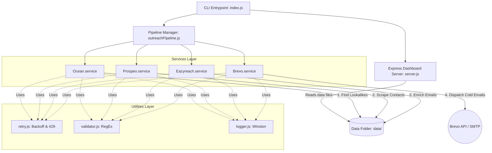

# Automated Outreach Pipeline

An automated, production-grade Node.js command-line application and visual monitor dashboard for outbound lead generation. 

The application executes a 4-stage pipeline:
1. **Ocean.io Integration**: Extracts lookalike company domains for a given target domain.
2. **Prospeo Integration**: Scrapes contact details for target domains and filters for decision-makers (CEO, CTO, Founder, VP, Head).
3. **Eazyreach Integration**: Enriches LinkedIn profile URLs to retrieve validated work email addresses.
4. **Brevo Integration**: Generates personalized outreach templates and handles transactional cold email dispatching, protected by a safety checkpoint verification.

---

## Architecture Diagram

The codebase is built on **Modular Clean Architecture**, separating utilities, services, orchestration, and interface layers:



---

## Features

- **Commander.js CLI Parser**: Run pipeline executions cleanly using `node src/index.js <domain>`.
- **Hybrid Mock/Live Core**: Bypasses missing API credentials by defaulting to high-quality mock lookup lists, contact scrapers, email verification records, and Brevo delivery mocks when `MOCK_MODE=true` is set.
- **Fail-Safe Resume Support**: Continually caches the pipeline state to a file (`data/pipelineState.json`), letting the user resume from interrupted execution using the `--resume` option.
- **Deduplication Engine**: Filters out duplicate companies in Stage 1 and duplicate contacts/emails in Stage 2 & 3.
- **Compliant Exponential Retry Utility**: Handles temporary connection drops and checks for HTTP `429` status to sleep for durations specified by the `Retry-After` header.
- **Winston Logger**: Integrates detailed console logs with level color coding and JSON structured file logs in the `logs/` directory.
- **CSV Exporter**: Generates a clean tabular CSV report at `data/outreach_summary.csv` when the `--csv` flag is used.
- **Express Monitoring Dashboard**: Serves a sleek, dark glassmorphic UI page at **http://localhost:3000** allowing developers to monitor lookalike search outcomes, parsed names/job roles, and email dispatch status in real time.

---

## Environment Variables

Create a `.env` file based on `.env.example`:

```env
# Server Port (if running Express server)
PORT=3000

# Pipeline Mode
# When MOCK_MODE is true, services return simulated data without calling live APIs.
# Set to false to use actual API credentials.
MOCK_MODE=true

# Logging Level (error, warn, info, debug)
LOG_LEVEL=info

# API Keys (Provide real credentials here when MOCK_MODE=false)
OCEAN_API_KEY=your_ocean_api_key_here
PROSPEO_API_KEY=your_prospeo_api_key_here
EAZYREACH_API_KEY=your_eazyreach_api_key_here
BREVO_API_KEY=your_brevo_api_key_here

# Brevo Email Configuration
BREVO_SENDER_EMAIL=outreach@yourdomain.com
BREVO_SENDER_NAME="Outreach Team"
```

---

## Installation Steps

1. **Clone or navigate to the project directory:**
   ```bash
   cd automated-outreach-pipeline
   ```
2. **Install Dependencies:**
   ```bash
   npm install
   ```
3. **Environment Setup:**
   ```bash
   cp .env.example .env
   ```

---

## Running the Project

### 1. Mock Mode
To test the pipeline out-of-the-box using the built-in high-fidelity simulated database:
```bash
node src/index.js google.com --mock --csv --yes
```

### 2. Live API Mode
To query the actual service API endpoints:
1. Set `MOCK_MODE=false` in `.env` and fill in your API credentials.
2. Run the command:
   ```bash
   node src/index.js google.com --csv
   ```

### 3. Monitoring Dashboard
To watch the pipeline process data in real time:
```bash
node src/index.js google.com --mock --server
```
Open **http://localhost:3000** in your browser.

---

## API Integrations Detail

1. **Ocean.io** (`src/services/ocean.service.js`):
   - Hits lookalike lookup endpoints using Bearer Token authentication (`Authorization: Bearer <key>`).
2. **Prospeo** (`src/services/prospeo.service.js`):
   - Queries B2B contact lists using the custom Header key authentication `X-KEY`. Filters profiles by executive job titles.
3. **Eazyreach** (`src/services/eazyreach.service.js`):
   - Enriches LinkedIn profiles into verified emails using Bearer Token authentication.
4. **Brevo** (`src/services/brevo.service.js`):
   - Communicates with SMTP Transactional API using the `api-key` header to dispatch cold templates.

---

## Error Handling & Retry Logic

- **Exponential Backoff**: Configured inside `src/utils/retry.js`, the retry engine retries failed calls by scaling wait intervals (`delay * factor`).
- **429 Rate-Limit Compliance**: The retry wrapper parses the `Retry-After` header. If the endpoint responds with `429 Too Many Requests` and provides a delay duration, the script sleeps for the exact duration requested.
- **Fail-Fast for Client Errors**: Errors such as `401 Unauthorized` or `404 Not Found` bypass retries and fail immediately to prevent credential lockout or unnecessary API billing.

---

## Future Improvements

1. **OAuth2 Integrations**: Support secure OAuth2 consent flows for direct calendar and email client integrations (e.g. Gmail/Outlook API).
2. **Domain Warming & Verification**: Integrate SPF, DKIM, and DMARC checking utilities before cold mailing.
3. **Queueing System**: Integrate BullMQ/Redis to support high-throughput parallel workers.
