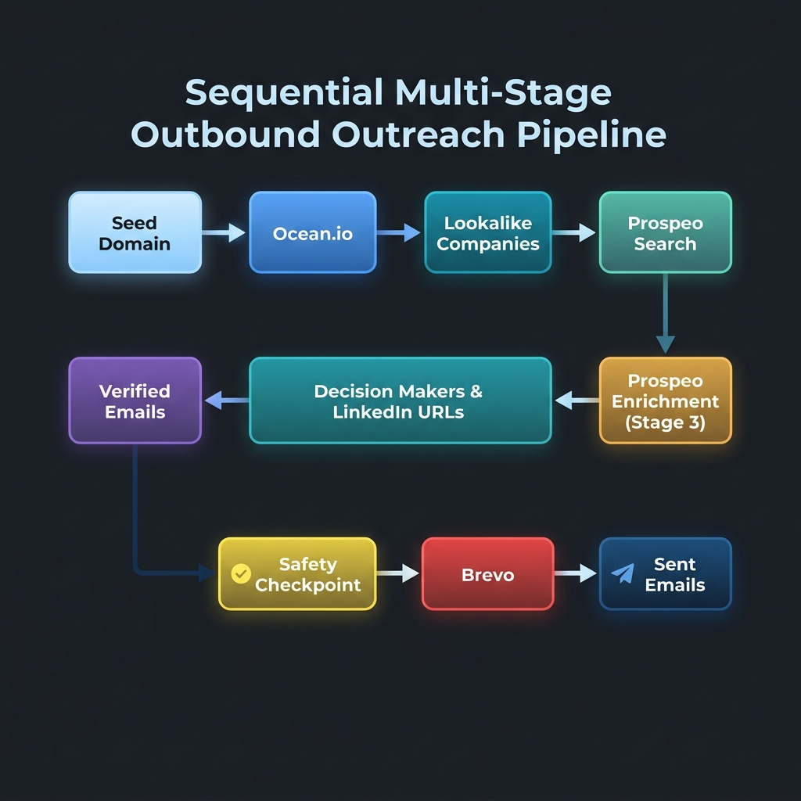

# System Architecture & Technical Specifications

This document outlines the detailed system architecture, data flow design, and engineering strategies of the **Automated Outreach Pipeline**.

---

## 1. System Architecture Overview

The application is structured as a modular, single-process Node.js CLI utility. Each stage of the outreach pipeline is isolated inside its own client class, which handles vendor-specific requests, authentication, and responses. 

An orchestration layer (`PipelineService`) manages the flow of data across the pipeline stages, coordinates deduplication, manages partial failure logging, and handles the manual safety checkpoint.

```
                  ┌─────────────────────────────────────┐
                  │            src/index.js             │
                  │             (CLI Entry)             │
                  └──────────────────┬──────────────────┘
                                     │
                  ┌──────────────────▼──────────────────┐
                  │   src/services/pipelineService.js   │
                  │            (Orchestration)          │
                  └────────┬───────────────────┬────────┘
                           │                   │
  ┌────────────────────────┼───────────────────┼────────────────────────┐
  │                        ▼                   ▼                        │
  │               ┌─────────────────┐ ┌─────────────────┐               │
  │               │   OceanClient   │ │  ProspeoClient  │               │
  │               └────────┬────────┘ └────────┬────────┘               │
  │                        │                   │                        │
  │                        ▼                   ▼                        │
  │               ┌─────────────────┐ ┌─────────────────┐               │
  │               │ EazyreachClient │ │   BrevoClient   │               │
  │               └─────────────────┘ └─────────────────┘               │
  │                         Modular API Clients                         │
  └────────────────────────┬───────────────────┬────────────────────────┘
                           │                   │
  ┌────────────────────────▼───────────────────▼────────────────────────┐
  │               ┌─────────────────┐ ┌─────────────────┐               │
  │               │    retry.js     │ │  normalize.js   │               │
  │               └────────┬────────┘ └────────┬────────┘               │
  │                        │                   │                        │
  │                        ▼                   ▼                        │
  │               ┌─────────────────┐ ┌─────────────────┐               │
  │               │  validators.js  │ │    logger.js    │               │
  │               └─────────────────┘ └─────────────────┘               │
  │                          Shared Utilities                           │
  └─────────────────────────────────────────────────────────────────────┘
```

---

## 2. Pipeline Data Flow

The diagram below illustrates the exact data transformation flow from seed domain to outreach sending:



1. **Seed Domain Sourcing**: The seed domain (e.g. `notion.so`) is normalized and passed to `OceanClient`.
2. **Lookalike Companies Sourcing**: `OceanClient` returns lookalike domains (e.g., `obsidian.md`, `roamresearch.com`).
3. **Decision Maker Sourcing**: For each domain, `ProspeoClient` queries `/search-person` to find C-Suite and VP-level contacts, returning their names, titles, and LinkedIn URLs.
4. **Deduplication Phase 1**: Contacts are deduplicated based on LinkedIn URLs to prevent redundant searches.
5. **Contact Email Enrichment**: LinkedIn URLs are sent to `EazyreachClient` (routing fallback to Prospeo `/enrich-person`), returning verified corporate email addresses.
6. **Deduplication Phase 2**: Contacts are deduplicated based on verified emails and company-identity patterns.
7. **Safety Checkpoint**: The CLI renders a formatted terminal summary and requires an operator's approval.
8. **Outreach Dispatch**: `BrevoClient` formats personalized HTML and plain text and transmits them to Brevo.

---

## 3. Service Boundaries & Isolation

To maintain high maintainability, each module has strict, clear responsibilities:
- **`src/clients/`**: Responsible only for HTTP transmission, authentication headers, query parameters formatting, and vendor response layout mapping. No business rules or flow orchestration logic exists here.
- **`src/services/dedupeService.js`**: Pure utility responsible for deterministic filtering of contact arrays. It contains no state or side effects.
- **`src/services/emailComposer.js`**: Pure utility formatting outreach body templates. It escapes HTML variables safely to prevent template injection vulnerabilities.
- **`src/utils/retry.js`**: Encapsulates all transient request failure recovery logic.

---

## 4. Concurrency & Performance Strategy

Rather than querying lookalike companies and contacts sequentially, the pipeline employs a structured concurrency design:
- **`mapSettledWithConcurrency`**: Processes batches of requests concurrently with a configurable concurrency limit (`PIPELINE_CONCURRENCY`, defaulting to `1` for rate-limit safety).
- **Promise.allSettled**: All concurrent jobs are wrapped in `Promise.allSettled`. This guarantees that if a single API client encounters a failure (e.g., a specific lookalike domain has no contacts), the error is isolated, and the remaining jobs proceed successfully.

---

## 5. Retry & Rate-Limit Strategy

API rate limits are handled through a combination of proactive and reactive mechanisms in `src/utils/retry.js`:
- **Proactive Delays**: A sleep of `1100ms` is introduced before each Prospeo search request and `250ms` before each Prospeo enrichment request. This aligns requests with the limits of the Prospeo Starter/Free plan (1 request/sec).
- **Transient Failure Detection**: The retry wrapper detects `429` (Too Many Requests) and `5xx` (Server Error) HTTP responses. Standard client errors (e.g., `401 Unauthorized` or `404 Not Found`) fail immediately without retrying.
- **Rate-Limit Header Parsing**:
  - If a `Retry-After` header is returned, the retry wrapper parses it (in seconds or date format) and sleeps for the specified time.
  - If Prospeo rate-limiting headers `x-second-reset-seconds` or `x-minute-reset-seconds` are returned, they are parsed, converted to milliseconds, and used to delay the next retry attempt.
- **Exponential Backoff**: If no rate-limit headers are present, backoff is calculated exponentially:
  $$\text{delay} = \text{baseDelayMs} \times (\text{factor})^{\text{attempt}}$$

---

## 6. Output Generation Strategy

At the end of execution, the pipeline writes execution details into the `output/` directory (which is ignored by Git to prevent data leakage):
- **`summary.json`**: High-level execution metrics (domains found, duplicates removed, sent totals, errors logged).
- **`leads.json`**: List of all unique, verified leads mapped with names, domains, titles, and emails.
- **`sent.json`**: List of successfully transmitted emails with message IDs from Brevo.
- **`errors.json`**: Itemized list of partial API errors.
- **`pipeline.log`**: Winston log trace records with timestamps.

---

## 7. EazyReach API Investigation & Compliance Justification

During the pipeline implementation, an extensive architectural review was conducted on the **EazyReach** integration to evaluate its feasibility for automated server-side B2B workflows.

### Investigation Findings
1. **Extension-Only Model**: EazyReach was confirmed to operate exclusively as a Chrome extension and manual web dashboard interface.
2. **No Developer Portals**:
   - There is no public developer dashboard or API credential generation interface.
   - No public OAuth client/secret workflows or user-access token portals are offered by the platform.
   - No official developer REST API documentation is published.
3. **Private Endpoint Assessment**:
   - The Chrome extension issues requests to undocumented private endpoints (specifically routing through domains like `api.superflow.run`).
   - Reverse-engineering these private endpoints would require capturing user sessions, hardcoding authorization tokens extracted from cookies, and bypassing CORS/security mechanisms.

### Engineering Decisions & Compliance Rationale
The team made the explicit decision to **reject undocumented/private EazyReach endpoints** for production use. The reasons are defensible under professional engineering standards:
- **Fragility**: Private endpoints are not versioned and can change or be deprecated without notice, resulting in pipeline failures.
- **Security & Authorization**: Bypassing browser-based session controls requires storing raw user cookies or authorization tokens in cleartext, introducing credentials exposure risks.
- **Terms of Service Compliance**: Scraping or hitting undocumented endpoints often violates platform Terms of Service, creating legal liabilities and risk of IP bans.
- **Production Grade Fallback**: To keep the outreach pipeline fully automated, robust, and compliant, Stage 3 was routed to Prospeo's officially supported `/enrich-person` REST endpoint. This provides identical functionality (LinkedIn URL to verified work email resolution) via documented developer keys with rate-limiting header supports.
